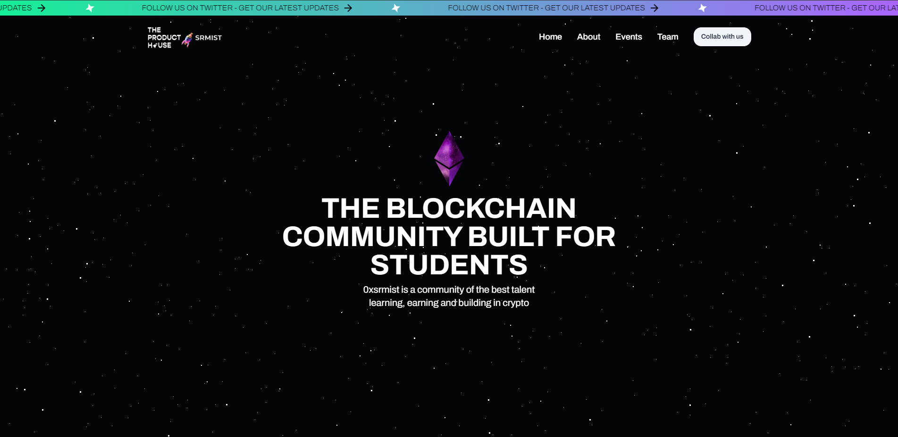

# TPHxSRMIST Main Website [v2]



## Introduction

Welcome to the official repository for the TPHxSRMIST Main Website. This website serves as the digital hub for The Product House (TPH) community at SRM Institute of Science and Technology (SRMIST), bringing together tech enthusiasts, developers, and creative minds.

Built with TypeScript, Next.js, Nodemailer, Sanity, Tailwind CSS, and App-Router, this website reflects our commitment to using cutting-edge technologies.

## Getting Started

Follow these steps to get the project up and running on your local machine:

1. Clone the repository:

   ```bash
   git clone https://github.com/0xsrmist/Main-Website.git
   ```

2. Navigate to the project directory:

   ```bash
   cd Main-Website
   ```

3. Install dependencies using [pnpm](https://pnpm.io/):

   ```bash
   pnpm install
   ```

4. Set up your environment variables by creating a `.env.local` file. Use the provided `.env.sample` as a reference.

5. Start the development server:

   ```bash
   pnpm run dev
   ```

6. Open your browser and visit [http://localhost:3000](http://localhost:3000) to view the website.

## How to Contribute

We welcome contributions from the community. To contribute to the project, follow these quick steps:

1. Fork the repository.

2. Create a new branch for your feature or bug fix:

   ```bash
   git checkout -b feature/new-feature
   ```

3. Make your changes and commit them:

   ```bash
   git commit -m "Add new feature"
   ```

4. Push your changes to your fork:

   ```bash
   git push origin feature/new-feature
   ```

5. Open a pull request, and your changes will be reviewed.

## Resources

- **Contribution Guidelines:** If you're interested in contributing to the project, please follow the guidelines outlined in [CONTRIBUTING.md](CONTRIBUTING.md).

- **In-Depth Guide to Sanity CMS:** For detailed instructions on adding new documents to Sanity, refer to our [GitHub Wiki](https://github.com/0xsrmist/Main-Website/wiki/). This guide provides a step-by-step flow to ensure a seamless content management experience.

## License

This project is licensed under the [MIT License](LICENSE).

### ⚔ Forking This Repo

Many people have contacted us asking if they can use this code for their own websites. The answer to that question is usually "yes", with attribution. There are some cases, such as using this code for a business or something that is greater than a personal project, that we may be less comfortable saying yes to. If in doubt, please don't hesitate to ask us.

We value keeping this project open source, but as you all know, plagiarism is bad. We actively spend a non-negligible amount of effort developing, designing, and trying to perfect this iteration of our project, and we are proud of it! All we ask is to not claim this effort as your own.

So, feel free to fork this repo. If you do, please just give us proper credit by linking back to this repo, [https://github.com/0xsrmist/Main-Website](https://github.com/0xsrmist/Main-Website). Refer to this handy [quora](https://www.quora.com/Is-it-bad-to-copy-other-peoples-code) post if you're not sure what to do. Thanks!

## Features

- TypeScript for enhanced development.
- Next.js for a powerful React framework.
- Nodemailer for sending emails.
- Sanity for structured content management.
- Tailwind CSS for utility-first styling.
- App-Router for efficient routing.

Feel free to explore and contribute to make this website a vibrant space for our community!

